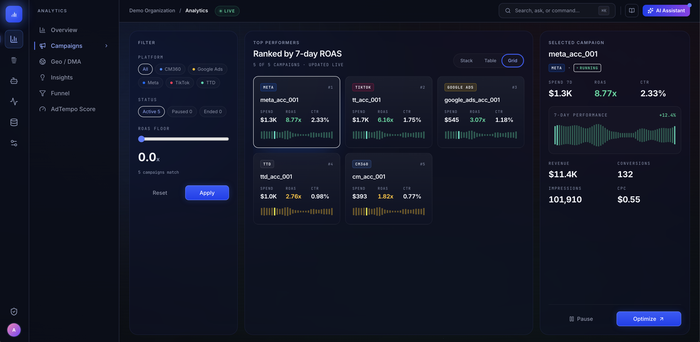
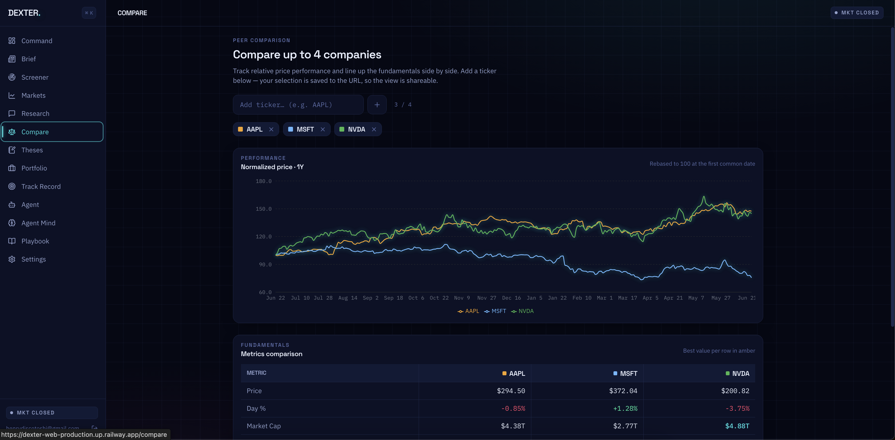
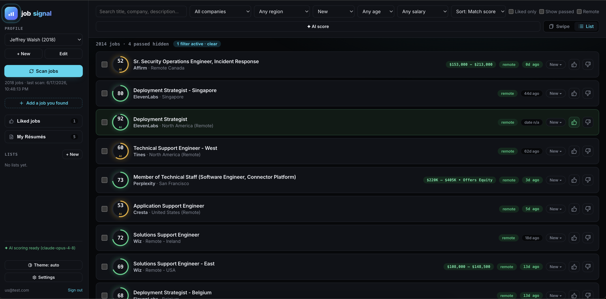
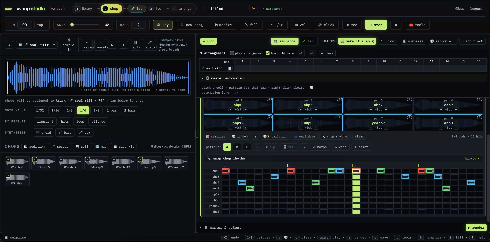

<h1 align="center">Hi, I'm Jeffrey Walsh 👋</h1>

  I design, build, and ship full products end-to-end — solo, bootstrapped with AI and frontier tooling. 
  From autonomous agent fleets to audio workstations to e-commerce. I love getting my hands dirty.

  
  

  📧 <a href="mailto:jwsoundsystems@gmail.com">jwsoundsystems@gmail.com</a> &nbsp;·&nbsp; 📍 Santa Fe, NM · Remote

---

> 💡 **My repositories are private** — these are real, commercial-grade products with proprietary IP. But every project below is **live and clickable**, with a screenshot of it actually running. I'd rather show you working software than a code dump. For a deeper technical walkthrough, just reach out.

---

## 🚀 Featured Projects

### 🎯 [AdTempo](https://adtempo.io) — Cross-Platform Marketing Intelligence
An all-in-one ad-measurement platform unifying **TikTok, Meta, and Google CM360** into one dashboard — run by a fleet of **27 autonomous agents** that ingest data, reconcile attribution, and rank campaigns by real ROAS live. I built the whole thing: agent architecture, data pipeline, attribution models, and a **"Briefing Rewind"** feature that turns written reports into auto-playing audio digests via the **ElevenLabs** TTS API.

`TypeScript` · `Autonomous Agents` · `ElevenLabs` · `Multi-platform APIs` · `Attribution Modeling`

🔗 **Live:** [adtempo.io](https://adtempo.io)

---

### 📈 [Dexter](https://dexter-web-production.up.railway.app) — AI Financial Research
A financial-research workspace: compare companies side by side, track normalized price performance, line up fundamentals, and let an agent build the thesis. Full-stack web app with its own API and data layer.

`TypeScript` · `Financial Data` · `AI Analysis` · `Full-stack`

🔗 **Live:** [dexter-web-production.up.railway.app](https://dexter-web-production.up.railway.app) *(demo login available on request)*

---

### 🧭 [Job Signal](https://job-signal-production.up.railway.app) — Customizable Job-Search Engine
A fully customizable job-hunting platform: it scans **9+ ATS providers** for live roles, scores each against your background with AI, and generates **tailored résumés and cover letters** per posting — reading the job first, then steering the writer. Built on a zero-dependency Python stack.

`Python` · `Claude API` · `ATS Integrations` · `Structured Generation` · `PDF Tooling`

🔗 **Live:** [job-signal-production.up.railway.app](https://job-signal-production.up.railway.app)

---

### 🎛️ [Swoop Studio](https://swoop-production.up.railway.app) — Digital Audio Workstation
A browser-based DAW and beat-making workstation — sample chopping, waveform editing, step sequencing, and arrangement, all in the browser. Roots in my professional audio background (signal validation, FFT/SIM analysis, pro-audio systems).

`Python` · `Web Audio` · `DSP` · `Real-time Sequencing`

🔗 **Live:** [swoop-production.up.railway.app](https://swoop-production.up.railway.app) — **demo login:** `demo` / `swoopstudio` *(isolated sandbox — log in and start chopping)*

---

### 🌶️ [NM Chile Co](https://www.nmchileco.com) — E-Commerce
Authentic New Mexico chile, shipped from Santa Fe — a small-batch e-commerce business I started and run with my wife: storefront, catalog, and fulfillment. Proof I can take an idea from zero to selling real product to real customers.

`TypeScript` · `E-commerce` · `Storefront`

🔗 **Live:** [www.nmchileco.com](https://www.nmchileco.com)

---

## 🛠️ How I Build
- **Ship full products solo** — architecture → backend → frontend → deploy, end to end.
- **AI-native** — I build *with* frontier models (Claude, ElevenLabs) and I build *products powered by* them.
- **Deployed and real** — everything above runs in production with live data, not a sandbox.
- **Background** — professional audio/QA engineering (Meyer Sound), customer & technical support (Strike, Swan), and now full-stack product building.

  <em>Want a closer look at any of these? <a href="mailto:jwsoundsystems@gmail.com">Reach out</a> — happy to give you a guided walkthrough or temporary access.</em>

